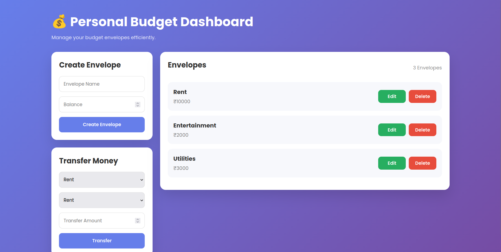

# 💰 Personal Budget

A **full-stack Personal Budget Management** web application built with **Node.js**, **Express.js**, and **Vanilla JavaScript**. It enables users to create, update, delete, and transfer funds between budget envelopes through a clean, responsive, and intuitive dashboard.

## 🚀 Live Demo

🌐 **Application:** https://personal-budget-8rp7.onrender.com

> **Note:** This application is hosted on Render's free tier. The initial request may take **30–60 seconds** while the server wakes up.

---

## 📸 Preview



---

## ✨ Features

* 📋 View all budget envelopes
* ➕ Create new envelopes
* ✏️ Edit envelope details
* 🗑️ Delete envelopes
* 💸 Transfer funds between envelopes
* 📱 Responsive dashboard UI
* ⚡ RESTful API built with Express.js
* 🔄 Dynamic frontend powered by Fetch API & Async/Await
* 🌐 Automatic local/production API detection

---

## 🛠️ Tech Stack

### Frontend

* HTML5
* CSS3
* JavaScript (ES6+)

### Backend

* Node.js
* Express.js
* CORS

### Deployment

* Render

---

## 📂 Project Structure

```text
personal-budget/
│
├── data/
│   └── envelopes.js
├── public/
│   ├── index.html
│   ├── style.css
│   └── main.js
├── routes/
│   └── envelopes.js
├── app.js
├── package.json
├── package-lock.json
├── README.md
└── .gitignore
```

---

## 🚀 Getting Started

### Clone the repository

```bash
git clone https://github.com/atetoon/personal-budget.git
cd personal-budget
```

### Install dependencies

```bash
npm install
```

### Run the application

```bash
npm start
```

or

```bash
node app.js
```

Open your browser and visit:

```text
http://localhost:3000
```

> The application automatically detects whether it is running locally or in production, so no API URL changes are required.

---

## 📡 API Endpoints

| Method | Endpoint              | Description                      |
| :----: | :-------------------- | :------------------------------- |
|   GET  | `/envelopes`          | Retrieve all envelopes           |
|   GET  | `/envelopes/:id`      | Retrieve a specific envelope     |
|  POST  | `/envelopes`          | Create a new envelope            |
|   PUT  | `/envelopes/:id`      | Update an existing envelope      |
| DELETE | `/envelopes/:id`      | Delete an envelope               |
|  POST  | `/envelopes/transfer` | Transfer funds between envelopes |

---

## 📥 Sample Requests

### Create an Envelope

```http
POST /envelopes
```

```json
{
  "title": "Travel",
  "balance": 5000
}
```

### Transfer Funds

```http
POST /envelopes/transfer
```

```json
{
  "from": 1,
  "to": 2,
  "amount": 1000
}
```

---

## 🎯 Future Improvements

* User Authentication
* Persistent Database (MongoDB/PostgreSQL)
* Budget Analytics Dashboard
* Search & Filter Functionality
* Transaction History
* Custom Edit Modal
* Toast Notifications
* Dark / Light Theme
* Unit & Integration Tests

---

## 👨‍💻 Author

**Dhruv Pandey**

* GitHub: https://github.com/atetoon

---

## ⭐ If you like this project

If you found this project helpful or interesting, consider giving it a ⭐ on GitHub!
